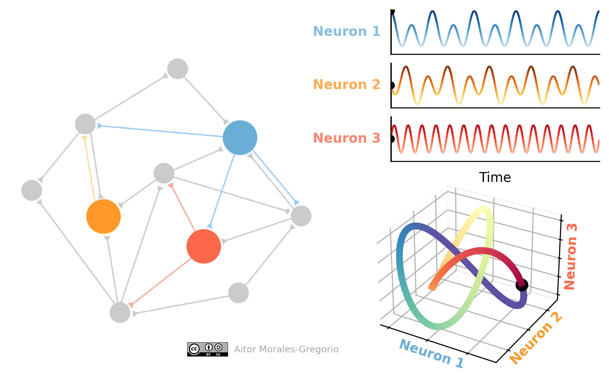

# Animation of a trefoil knot from neuron dynamics
This repository contains the necessary code to create an animation of population dynamics following a Trefoil knot.



## Requirements
The exact conda environment used to create the animation can be created from the provided `environment.yml` file as:
```
conda env create -f environment.yaml
```

This work requires the latest version of matplotlib. In fact, the latest version was modified to fix the Z-ordering problem.
```
matplotlib >= 3.6.1
```

### Z-ordering problem
The standard matplotlib scripts do not correctly order the depth of lines. Thus I had to modify the latest matplotlib version to be capable of this, PR will be posted soon. In the meantime one can use the temporary fix from [this fork](https://github.com/morales-gregorio/matplotlib/tree/zorder_lines).

## Trefoil knot
I used a cartesian representation of the trefoil knot in as the dynamics of the neurons:

$$
\begin{align}
  N_1 &= \cos{t} + 2 \cos{2t} \\ 
  N_2 &= \sin{t} - 2 \sin{2t} \\
  N_3 &= 2 \sin{3t}
\end{align}
$$

See [this blog post](https://mathcurve.com/courbes3d.gb/noeuds/noeuddetrefle.shtml) for more details.

## License

This work is licensed under the Creative Commons Attribution-ShareAlike 4.0 International Public License.
